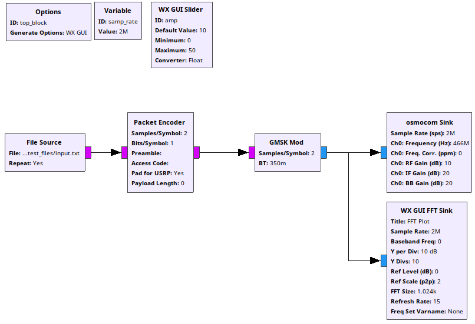
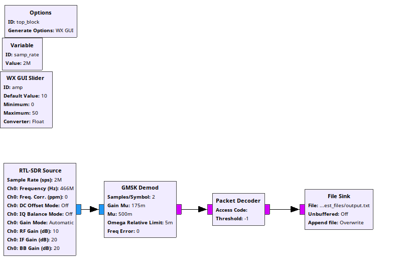

# Note from gnuradio (hackaday)

https://www.youtube.com/watch?v=ufxBX_uNCa0

gnuradio -> fait en python2 (plutot cool, pour automatiser des trucs)
         -> possibilité de générer les scripts run > generate (F5)
             => RPi 0, bouton poussoir pour activer et hop ;)

Block options:

* generate options -> WX pour windows et Qt pour linux (mais on peut installer les deux sur linux)
    * Déterminantn puor les trucs visuels


## Tests

### Émission de "bite de poulet"



gen_script/Emission_466MHz_HackRF.py  

### Réception de "bite de poulet"



gen_script/Reception_466MHz_RTLSDR.py

## Erreurs

### Erreur de reception GNURadio

```bash
Traceback (most recent call last):
  File "/usr/lib/python2.7/site-packages/gnuradio/wxgui/scopesink_nongl.py", line 533, in format_data
    self.Draw(graphics, xAxis=x_range, yAxis=self.y_range)
  File "/usr/lib/python2.7/site-packages/gnuradio/wxgui/plot.py", line 903, in Draw
    self._drawLegend(dc,graphics,rhsW,topH,legendBoxWH, legendSymExt, legendTextExt)
  File "/usr/lib/python2.7/site-packages/gnuradio/wxgui/plot.py", line 1206, in _drawLegend
    o.draw(dc, self.printerScale, coord= _numpy.array([pnt1,pnt2]))
  File "/usr/lib/python2.7/site-packages/gnuradio/wxgui/plot.py", line 211, in draw
    if coord == None:
ValueError: The truth value of an array with more than one element is ambiguous. Use a.any() or a.all()
```

=> Problème solved de manière un peu mystique... Mais ça fonctionne
